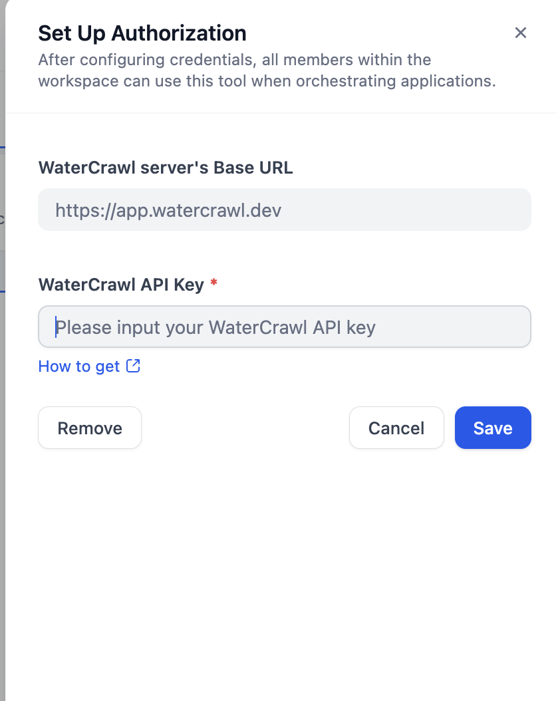

# WaterCrawl Plugin

**Author:** WaterCrawl  
**Version:** 0.3.0  
**Type:** Tool  

### Description  
WaterCrawl is a powerful web crawling tool designed for developers. This plugin allows you to easily crawl websites and extract data from them. It is compatible with WaterCrawl v0.3.* and offers a range of features for efficient data extraction.

## Features  
#### **Scrap Tool**:
Scrapes a single URL and outputs the content in various formats (markdown, HTML, JSON, or screenshot).  

|  |  |
| --- | --- |

#### **Crawl Tool**:
Initiates a web crawl to extract data from specified URLs with configurable options for including/excluding URL patterns and generating alt text for images.

|  |  |
| --- | --- |

### **Crawl Job Tool**: 
Retrieve scraping results based on a crawl request UUID and cancel ongoing scraping tasks.  

## Installation  
To install the WaterCrawl plugin, follow these steps:
Download the latest `.difypkg` file from the [GitHub Releases](https://github.com/watercrawl/watercrawl-dify-plugin/releases) or from the Dify marketplace.

## Authentication  
Login to your WaterCrawl account [here](https://app.watercrawl.dev/). Or your self-hosted WaterCrawl instance. In the dashboard go to `API Keys` and create a new key or use an existing key.

then in the Dify plugin management page, go to `Plugins` and click on the `+ Install` button. and use `API Key` in the plugin configuration.

## Contributing / Development  
To contribute to the WaterCrawl plugin, follow these steps:
1. Clone the repository: `git clone https://github.com/watercrawl/watercrawl-dify-plugin.git`
2. Navigate to the project directory: `cd watercrawl-dify-plugin`
3. Make virtual environment: `python -m venv env`
4. Activate the virtual environment: `source env/bin/activate`
5. Install dependencies: `pip install -r requirements.txt`
6. Copy the `.env.example` file to `.env` and fill in the necessary values.
7. Run the plugin: `python -m main`

### Support  
For support, please contact us at [support@watercrawl.dev](mailto:support@watercrawl.dev).

### License  
This project is licensed under the MIT License - see the [LICENSE](LICENSE) file for details.
